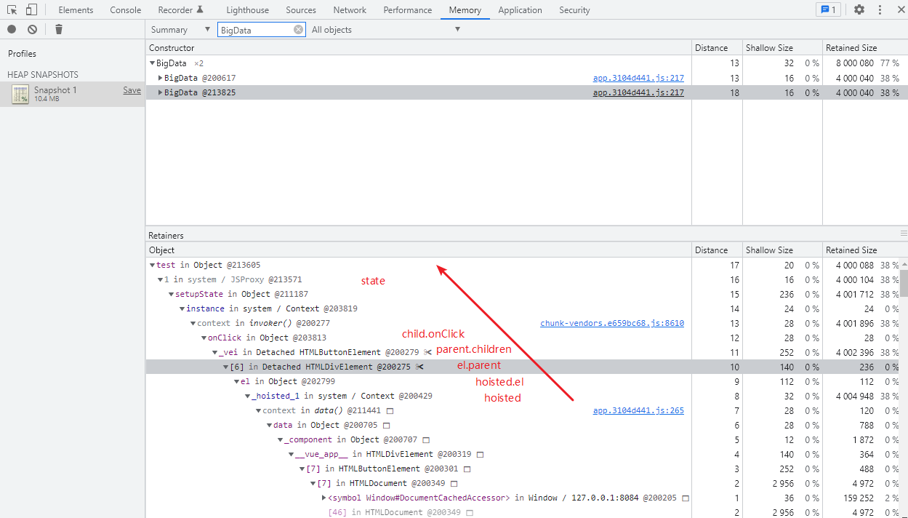

## Problem
Problem

静态节点优化会在闭包中创建一个 _hoisted_${num} 的变量，之后渲染时，会将 _hoisted_.el 设置为dom。假如此组件中有事件监听，则会造成实例无法回收，从而造成内存泄漏。

Static hoist will creates a hoisted variable in the closure, and later sets dom to hoisted.el when rendering.  If there are event listeners in the component, the component instance cannot be recycled, resulting in a memory leak.  

Object reference chain:

- _hoisted_
- _hoisted_.el
- _hoisted_.el.parentElement
- _hoisted_.el.parentElement.children
- children.onClick
- createInvoker
- instance

## Step
- Open `dist/index.html`
- Click `click` button three times.
- Open memory panel in chrome devtools, then take heap snapshot, then search BigData。

